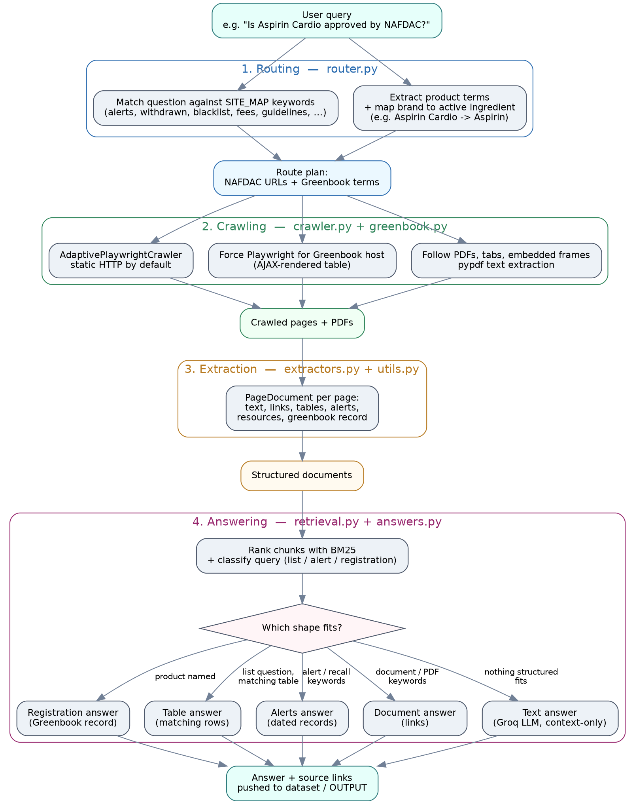

# NAFDAC Regulatory Assistant (rRx)

An [Apify Actor](https://apify.com) rRx that answers plain-language questions about anything Nigeria's National Agency for Food and Drug Administration and Control (NAFDAC) has published — public alerts, field safety notices, withdrawn products, blacklists, watchlists, guidelines, tariffs, Greenbook registrations, and more — by crawling `nafdac.gov.ng` live and answering only from what it finds, with links back to the original source.

It is **not** a general-purpose chatbot: it never answers from a model's own memory. Where a structured record exists (an alert, a withdrawn-product row, a Greenbook entry) the Actor returns that record directly. A language model is only consulted for the small set of questions that have no structured shape, and even then it is restricted to the retrieved context.

---

## Table of contents

- [How it works](#how-it-works)
- [Project layout](#project-layout)
- [The four layers](#the-four-layers)
  - [1. Routing — `router.py`](#1-routing--routerpy)
  - [2. Crawling — `crawler.py`, `greenbook.py`](#2-crawling--crawlerpy-greenbookpy)
  - [3. Extraction — `extractors.py`, `utils.py`](#3-extraction--extractorspy-utilspy)
  - [4. Answering — `retrieval.py`, `answers.py`](#4-answering--retrievalpy-answerspy)
- [Orchestration — `main.py`, `config.py`](#orchestration--mainpy-configpy)
- [Input](#input)
- [Output](#output)
- [Running locally](#running-locally)
- [Deploying on Apify](#deploying-on-apify)
- [Environment variables](#environment-variables)
- [Answer types](#answer-types)
- [Design notes and limitations](#design-notes-and-limitations)
- [Roadmap](#roadmap)

---

## How it works

A user submits one `query` (e.g. *"What are the latest drug recalls?"*, *"Is Aspirin Cardio approved by NAFDAC?"*, *"List products withdrawn in 2025"*). The Actor then:

1. **Routes** the question to the relevant sections of `nafdac.gov.ng` (and the Greenbook, if a product is named).
2. **Crawls** those sections with an adaptive Playwright/HTTP crawler, following tabs, embedded frames, and PDFs.
3. **Extracts** everything crawled into structured documents — alerts, table rows, Greenbook records, linked documents.
4. **Answers** the question from that structured data, falling back to an LLM (Groq) only when nothing structured applies.

Every answer, of every type, carries the source page and document links it was built from.

### Flow diagram



## Project layout

```
.
├── actor.json            # Actor metadata: name, memory, schema references
├── input_schema.json     # Defines the Actor's input form (query + settings)
├── output_schema.json    # Defines the Actor's output tab links
├── dataset_schema.json   # Defines the "answers" dataset view
├── main.py                # Entry point: wires config → crawl → answer → datasets
├── src/
│   ├── config.py          # Turns raw Apify input into an AppConfig
│   ├── router.py           # Question → NAFDAC URLs + Greenbook search terms
│   ├── crawler.py          # AdaptivePlaywrightCrawler setup and page handling
│   ├── greenbook.py        # Greenbook-specific automation (brand→active mapping, form search)
│   ├── extractors.py       # HTML → PageDocument (text, tables, alerts, resources, greenbook)
│   ├── utils.py            # URL canonicalization, text cleaning, table parsing
│   ├── retrieval.py        # Chunking, BM25 ranking, list/alert/count detection
│   └── answers.py          # The five answer branches (registration/table/alerts/document/text)
```

## The four layers

### 1. Routing — `router.py`

`plan_query(query)` deterministically decides which NAFDAC pages are worth visiting, with no LLM and no randomness — the same question always produces the same plan.

- **`SITE_MAP`** is a static list of topics (`alerts`, `field_safety`, `withdrawn`, `blacklist`, `watchlist`, `registered_products`, `fees`, `guidelines`, `regulations`, `chemicals`, `clinical_trials`, `inspection`, `exports`, `traceability`, `pharmacovigilance`, `news`, `contact`, `about`, and more), each with keyword triggers and the NAFDAC page paths that answer it.
- The question is scored against every topic's keywords; the top **`MAX_TOPICS = 3`** matches are kept.
- **`extract_product_terms(query)`** pulls out likely product names using regex tokenization, a stopword list (`_TERM_STRIP`) covering hundreds of question/category words, and a proper-noun fallback — deliberately conservative so generic words never become a "product."
- **`expand_terms()`** (via `greenbook.py`) translates retail brand names to the active ingredient the Greenbook indexes under (e.g. *Panadol → Paracetamol*), so a branded question still lands on the right record.
- If the question is about alerts/recalls/withdrawals/blacklists/watchlists, the Greenbook is **not** searched — those aren't Greenbook records.
- If a product term survives, the Greenbook URL is added to the crawl targets automatically.
- The plan always appends the site's own search page (`/?s=...`) and the homepage as a safety net, and falls back to alerts/FAQ/services pages if nothing in `SITE_MAP` matched at all.

### 2. Crawling — `crawler.py`, `greenbook.py`

`crawl_site(...)` runs a Crawlee **`AdaptivePlaywrightCrawler`**, which starts every page as a fast static HTTP/BeautifulSoup fetch and only escalates to a full Playwright browser when a page needs JavaScript.

- A custom **`NafdacRenderingTypePredictor`** forces Playwright (`"client only"`) for the Greenbook host and static rendering for everything else — deterministically, with no learning/adaptation step, because the Greenbook's table is known in advance to be AJAX-rendered.
- On every page, the handler:
  - Downloads and extracts text from **PDF** links directly (`_fetch_pdf`, via `pypdf`, capped at 60 pages).
  - Extracts the page into a `PageDocument` (see below).
  - Saves optional **debug HTML** snapshots to the key-value store when `debugHtml` is enabled.
  - On the Greenbook host, calls `search_greenbook()` for each of up to 3 `greenbook_terms`, trying the original term and its mapped active ingredient, and only keeps the result if the response HTML actually contains table rows (`has_rows`).
  - Enqueues same-domain links for further crawling.
- **`greenbook.py`** encapsulates everything Greenbook-specific:
  - `BRAND_TO_ACTIVE`: a hand-maintained dictionary of ~90 retail brand names → registered active ingredients across analgesics, antibiotics, antimalarials, antiparasitics, antihistamines, respiratory, GI, and cardiovascular/metabolic drugs.
  - `search_greenbook(page, term, timeout_ms)`: finds the visible product-name input, fills and submits it, and waits for a real `<tr>` to attach to the DOM (not just for `networkidle`, since the AJAX response can resolve while the UI is still painting).
  - `has_rows(html)`: a cheap regex check for `<tr><td>` in the result HTML.

### 3. Extraction — `extractors.py`, `utils.py`

Every crawled page/PDF becomes a `PageDocument` (`url`, `title`, `text`, `links`, `tables`, `greenbook`, `alerts`, `resources`) via `extract_page_document(url, html)`. Extraction is a **pure function of the HTML** — the same page always produces the same document.

- **`extract_greenbook(text, tables)`**: line-anchored regexes (`GREENBOOK_PATTERNS`) pull `product_name`, `registration_number`, `manufacturer`/`marketing_authorization_holder`, `status`, `active_ingredient`, `dosage_form`, `expiry`, `strength`, `approval_date`, and `product_category` out of page text and small tables. A match needs at least 2 fields including a name or reg. number to count as a real record; otherwise a loose "Green Book" mention is kept only as a `hint`. `map_greenbook_fields()` renames these onto the flatter output field names (`nrn`, `active_ingredients`, `form`, `applicant_name`, etc.) used in answers.
- **`extract_links(soup, base_url)`**: pulls URLs not just from `<a href>` but from iframes/embeds/objects, `data-*` attributes, and `onclick` JS handlers (`ONCLICK_URL_RE`), since NAFDAC's widgets often hide the real link there.
- **`extract_resources(soup, base_url)`**: finds linked documents (PDF/DOC/XLS/PPT/CSV) and embedded content, reading the URL off whichever attribute holds it, and skips nav/footer/aside chrome.
- **`extract_alerts(soup, base_url)`**: turns alert/recall/notice cards into `{date, alert_no, title, url, excerpt}` records, parsing dates (`DATE_RE`) and "Alert No. NN/YYYY" style numbers (`ALERT_NO_RE`) either from the link text or a nearby ancestor node.
- **`utils.extract_tables(soup, base_url)`**: parses every `<table>` (up to 30 per page, 2000 rows each) into header/row dicts, preserving any links found inside each cell so a row never loses its associated link.
- **`utils.canonicalize_url`**: resolves relative URLs, lowercases the host, and strips tracking query params (`utm_*`, `gclid`, `fbclid`).
- **`merge_documents(base, others)`**: folds extra snapshots (e.g. after clicking a tab) into one document, deduplicating alerts, tables, resources, and new text lines.

### 4. Answering — `retrieval.py`, `answers.py`

**`retrieval.py`** turns the crawled documents into a ranked list of candidate chunks:

- `build_chunks()` produces one chunk per alert, one per Greenbook record, sliding-window chunks of page text (900 chars, 150 overlap), and one chunk per table row.
- A small **BM25** implementation (Lucene-style IDF) scores chunks against the question's content tokens (stopwords and generic terms removed).
- `is_list_query`, `is_alert_query`, `is_registration_query`, `is_alert_recency_query` classify the question by keyword-set overlap.
- `extract_count(query)` reads an explicit number out of the question itself ("top 5", "last 10", "fetch 8", "three latest") via regex and a small word-number table; `resolve_limit()` then picks, in order: an explicit `maxResults` input → a count found in the query → the `defaultMaxResults` input → a built-in per-type default (10 alerts / 100 table rows / 25 documents / 25 registrations).
- For list-style questions, ranking returns up to `LIST_LIMIT = 300` chunks instead of the usual `top_k`, so nothing gets truncated before the answer step even sees it.

**`answers.py`** picks one of five answer shapes, in this fixed priority order:

1. **`structured_greenbook_answer`** — if the question's remaining tokens (after stripping registration/approval vocabulary) match a crawled Greenbook record's product name (expanding brand names to actives first), it returns that record directly: product name, NAFDAC reg. number, applicant, status, active ingredient, approval date — with a note explaining any brand→active substitution made.
2. **`structured_table_answer`** — only fires for list-style questions, and only when at least 3 usable rows exist from the *same* source page whose title/headers actually overlap the question's words. Placeholder rows ("no matching records found") and near-empty rows are filtered out. Rows are further filtered to the question's specific (non-generic) terms if any are present.
3. **`structured_alerts_answer`** — collects matching alert records, sorts them by parsed alert number (`NN/YYYY`) descending, and returns a single record when the question is phrased as "the latest"/"the last" with no explicit count, or a list otherwise.
4. **`document_answer`** — fires when the question uses document-shaped words (`document`, `pdf`, `chemical`, `narcotic`, etc.) and returns ranked links to matching PDFs/Office files/CSVs rather than a paraphrase of their contents.
5. **`_llm_text_answer`** — only reached when none of the above apply. Builds a context block (`build_context_block`) from the top-ranked chunks and calls **Groq** with a system prompt that restricts the model to the provided context and instructs it to say so when the answer isn't present. Tries the requested model first, then two fixed fallback models (`openai/gpt-oss-20b`, `llama-3.1-8b-instant`) with a 30-second timeout each. If Groq is unavailable (no API key, package missing, or every model fails), `_fallback_text` returns the single best-ranked excerpt instead, with a note saying so.

`useful_sources()` filters the final source list down to pages/documents that actually contain content (skipping empty "no results" pages), capped at 5.

## Orchestration — `main.py`, `config.py`

- **`config.AppConfig.from_input(raw)`** turns the raw Apify input into a typed config: parses `startUrls` (string or Apify's list-of-objects format), runs `plan_query()` when `autoRoute` is on, merges the routed URLs with any manual ones, derives `allowed_domains`, and applies default crawl depth/page limits (2/60 when auto-routed, 2/150 otherwise, unless overridden).
- **`main.py`**:
  1. Reads Actor input and builds `AppConfig`.
  2. Runs `crawl_site()`.
  3. Pushes every crawled page/PDF as an item to a named dataset called **`pages`**.
  4. If a query was given, ranks documents (`top_k` 40 for list queries, else 12) and calls `answer_question()`, then pushes a single `{type: "answer", ...}` record to the **default dataset**.
  5. Pushes a run-statistics record (`crawledPages`, `alertsFound`, `tableRows`, `crawledUrls`, ...) to a named dataset called **`runs`**.
  6. Writes the same answer record to the key-value store under **`OUTPUT`**.

Records are pushed in batches of 50 (`PUSH_BATCH_SIZE`) to `_push_batched()`.

## Input

Defined in `input_schema.json`. Only `query` is required.

| Field | Type | Description |
|---|---|---|
| `query` | string (required) | The question, in plain language. |
| `maxResults` | integer | Hard cap on records returned for list-style answers; overrides everything else if set. |
| `defaultMaxResults` | integer | Fallback count when the question itself contains no number and `maxResults` is blank. |
| `autoRoute` | boolean (default `true`) | Automatically choose NAFDAC sections to crawl based on the question. |
| `startUrls` | array | Extra pages to crawl in addition to the auto-routed ones. |
| `aiModel` | select (default `openai/gpt-oss-120b`) | Groq model used for free-form text answers. Also offers `openai/gpt-oss-20b` and `llama-3.1-8b-instant`. |
| `maxPages` | integer | Upper limit on pages/PDFs visited per run. |
| `crawlDepth` | integer (0–4) | How many link levels to follow from each start page. |
| `pageTimeoutMs` | integer (default 20000) | Per-page load timeout. |
| `debugHtml` | boolean (default `false`) | Save raw HTML snapshots of every crawled page to the key-value store. |

## Output

Defined in `output_schema.json` and `dataset_schema.json`.

- **Default dataset** — one record per run: `{type, query, answerType, answer, answerDetail, sources, notes}`. The `answers` dataset view exposes exactly these fields as a table. `answerType` is one of `registration | table | alerts | document | text`; the shape of `answerDetail` depends on it.
- **`pages` dataset** — every page and PDF read during the run (title, text, links, tables, alerts, resources, greenbook record if any).
- **`runs` dataset** — one summary record per run: pages crawled, alerts found, table rows extracted, URLs visited, start URLs, allowed domains.
- **Key-value store** — `OUTPUT` holds the answer record; `debug_<slug>` keys hold raw HTML snapshots when `debugHtml` is enabled.

## Running locally

The Actor is a Python package built on the `apify` SDK and Crawlee, intended to run inside the `apify/actor-python-playwright:3.11` Docker image so the same code behaves identically locally and on the platform.

```bash
# from the project root, with the Apify Python SDK and dependencies installed
apify run
```

Input is read the normal Apify way (local `storage/key_value_stores/default/INPUT.json`, or via `apify run` prompts). Set `GROQ_API_KEY` in the environment (or an Apify secret) before running if you want free-form (LLM) answers to work — structured answers (registration/table/alerts/document) work without it.

## Deploying on Apify

`actor.json` declares the Actor's metadata (`nafdac-regulatory-assistant`, 2–8 GB memory range, 4 GB default) and wires up the three schema files. Push it to the Apify platform as any Python Actor:

```bash
apify push
```

Once on the platform, the Actor can be triggered ad hoc, on a **schedule**, or via a **webhook** from another application — useful for a daily "check for new alerts" job or an inventory system polling the withdrawn-products list.

## Environment variables

| Variable | Purpose |
|---|---|
| `GROQ_API_KEY` | Required only for the free-form text answer branch (`answers.py` calls the Groq API). Never hard-code this — read from the environment or an Apify secret so it stays out of source control. |

## Answer types

| `answerType` | When it's used | `answerDetail` shape |
|---|---|---|
| `registration` | The question names a product and a matching Greenbook record was crawled. | `{records: [...]}` |
| `table` | A list-style question matches rows from one crawled table (e.g. withdrawn products). | `{page_title, page_url, total_rows, records: [...]}` |
| `alerts` | The question is about alerts/recalls/notices/blacklists/watchlists. | `{alert: {...}}` for a single latest result, or `{records: [...]}` for a list. |
| `document` | The question asks for a document/PDF/chemical list/etc. | `{documents: [...]}` |
| `text` | Nothing structured applies; answered by Groq (or, if unavailable, the single best-ranked excerpt). | `null` |

## Design notes and limitations

- **Deterministic by design.** Routing, term extraction, and extraction are all pure functions with no LLM involvement — the same question always crawls the same pages and extracts the same structured data. The LLM is confined to the last-resort text branch.
- **Answer priority is fixed and gated.** For example, the table branch requires ≥3 usable rows from a single page whose title/headers actually overlap the question, specifically to stop something like "recently recalled drugs" from matching an unrelated table just because it contains the word "drugs."
- **Brand-to-active mapping is a hand-maintained dictionary** (`BRAND_TO_ACTIVE` in `greenbook.py`), so it only covers the brands explicitly listed; unmapped brand names fall through to the Greenbook unchanged and may return no results.
- **PDF extraction is capped at 60 pages per file** and depends on `pypdf`'s text extraction, so scanned/image-only PDFs will not yield text.
- **The Greenbook table-ready check waits on the DOM**, not `networkidle`, since the AJAX response can resolve before the UI finishes rendering rows — this is a deliberate workaround for that specific site, not a general solution for other SPA-backed sources.

## Roadmap

- Widen the Greenbook search to also query by active ingredient and by applicant, not just product name.
- Expose a single **"check this product"** endpoint that returns one status — `registered`, `withdrawn`, `subject to an alert`, or `unknown` — by combining the Greenbook, withdrawal, and alert data the Actor already collects.
- Publish the Actor on the Apify Store with a stable, documented input schema.
